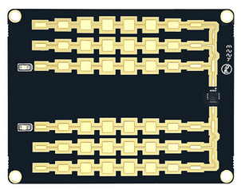
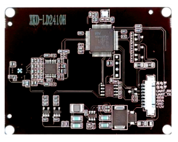

# LD2415H Velocity Radar Sensor
## Overview
The ld2415h sensor platform allows you to use the Hi-Link HLK-LD2415H velocity radar sensor ([datasheet](HLK-LD2415H(english).pdf)) with ESPHome to track the velocity of objects.  The sensor utilizes millimeter wave radar to measure the velocity of objects within it's field of view.

## Specifications
 The HLK-LD2415H is a velocity radar sensor module has the following specifications:
 * K-band RF circuit operating in the 24.125GHz frequency range (customizable)
 * Accurately measures object velocities from 1-240KM/H
 * A precision of less than 1KM/H
 * Range up to 180 meters.
 * Antenna angle is 40° horizontal with a 16° pitch
 * Capable of 22 samples per second
 * RS-485 and TTL Serial interfaces
 * Site specific angle and sensitivity configuration


## Product Images



## Sensor Communication
The UART is required to be set up in your configuration for this sensor to work. Use of hardware UART pins is recommended, however the HLK-LD2415H sensor is limited to a 9600 baud rate.

### Serial Interface Specification
The sensor has both RS-485 and TTL serial interfaces with a pair of RX and TX pins for each interface.  Either interface can be used to read or configure the sensor.

## ESPHome Example Configuration

Example yaml to use in esphome device config. The `ld2415h:` block is the
component itself (it owns the UART wiring); the sensor, number, and select
entries are the entities exposed from it.

```yaml
external_components:
  - source:
      url: https://github.com/cptskippy/esphome.ld2415h
      type: git
      ref: main
    components: ld2415h
    refresh: 0s

uart:
  tx_pin: 36
  rx_pin: 34
  baud_rate: 9600

ld2415h:
  - id: ld2415h_radar

sensor:
  - platform: ld2415h
    ld2415h_id: ld2415h_radar
    speed: # This is the absolute speed of the object
      name: Speed
      filters:
        # Sensor reports on speed down to 1km/h
        # we must zero out the speed manually
        # when the sensor stops reporting.
        - timeout:
            timeout: 0.1s
            value: 0
        # Sensor will constantly report speed
        # at the configured sample rate
        # this ensures we only report changes
        - delta: 0.1
    velocity: # This value is signed indicating approaching or retreating
      name: Velocity
      filters:
        - timeout:
            timeout: 1s
            value: 0
        - delta: 0.1

number:
  - platform: ld2415h
    ld2415h_id: ld2415h_radar
    min_speed_threshold:
      name: Minimum Speed Threshold
    compensation_angle:
      name: Compensation Angle
    sensitivity:
      name: Sensitivity
    vibration_correction:
      name: Vibration Correction
    relay_trigger_duration:
      name: Relay Trigger Duration
    relay_trigger_speed:
      name: Relay Trigger Speed

select:
  - platform: ld2415h
    ld2415h_id: ld2415h_radar
    sample_rate:
      name: Sample Rate
    tracking_mode:
      name: Tracking Mode
```

## Architecture

The serial protocol engine (command framing, response parsing, config state)
lives in the standalone [ld2415h](https://github.com/cptskippy/ld2415h)
library, which has no ESPHome dependency and is unit-tested on the host. This
component is a thin adapter: it wires the library's `Transport` interface to
`uart::UARTDevice`, forwards its log output to the ESPHome logger, and
exposes the parsed state as sensor/number/select entities.
